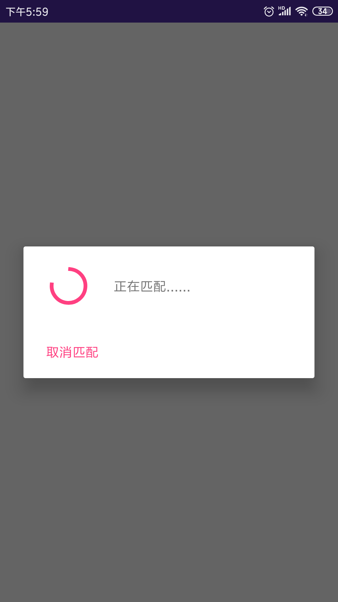
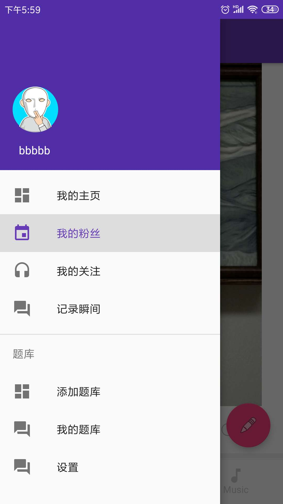
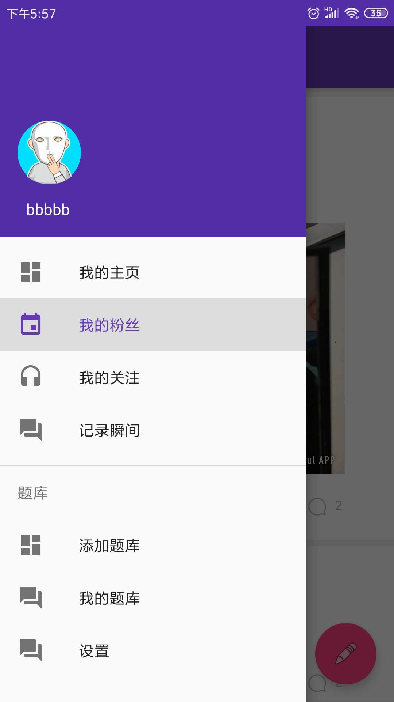
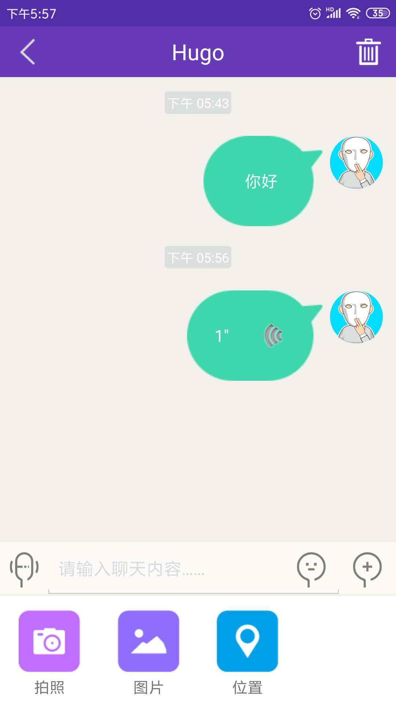
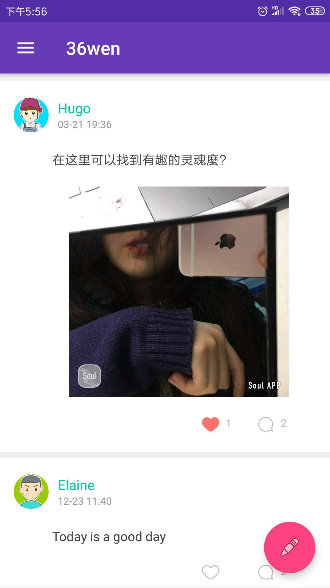

SocialApp
=============

## Summary
This application is a social app like weixin. And it is have a different function is can play Random Video Chat with Strangers. Two Stranger play set of 36 questions  with animoji and voice changer.

## Features
- friends of cicle
- instance message
- Real-time Video
- Real-time Audio
- android animoji
- voice changer
- random chat

## Points
- Material Design
- todo－mvp－dagger
- DrawerLayout + NavigationView + BottomNavigationView
- recycleview＋swiperefreshview
- eventbus greendao
- sound touch for voice changer
- learncloud for server
- qiniu Cloud for file storage
- easeui for instance message
- Agora for media stream
- offline animoji function
- theme use soul app
- offline animoji functio

## Useage
- you should register learncloud,easeui,agora,qiniu account . replace the id they gives (find in git log) 
- LearnCloud (https://leancloud.cn/)
- easeUi (http://www.easemob.com)
- agora (https://www.agora.io/)
- qiniu (https://www.qiniu.com/)

## Screenshots

